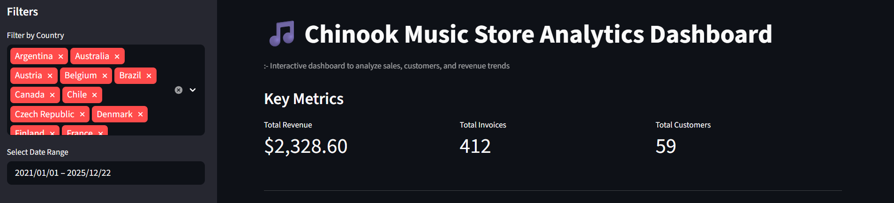
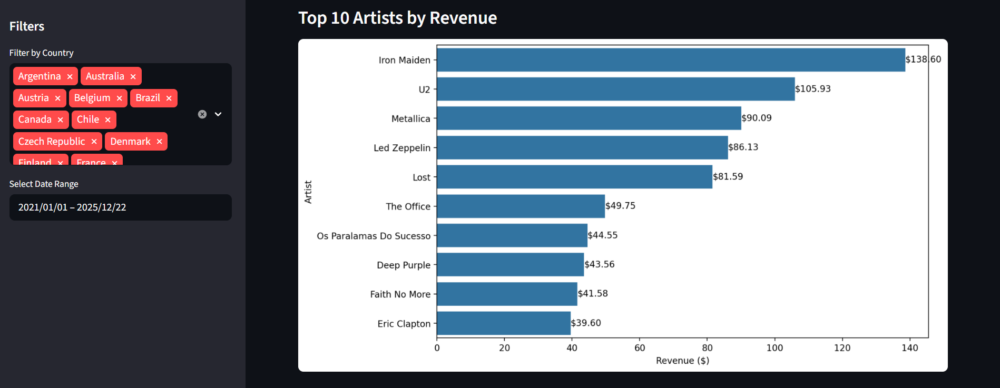
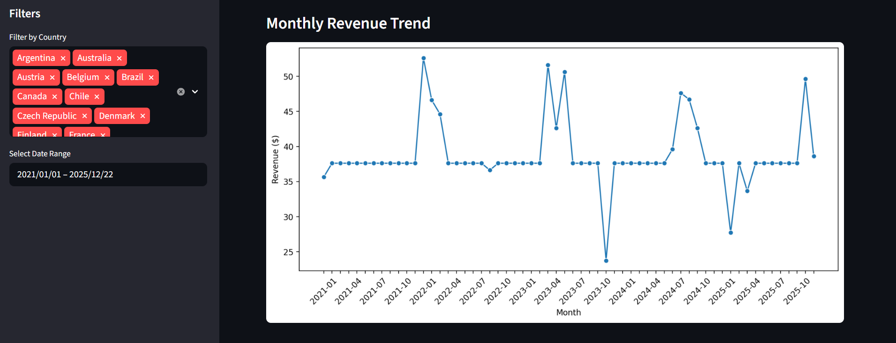
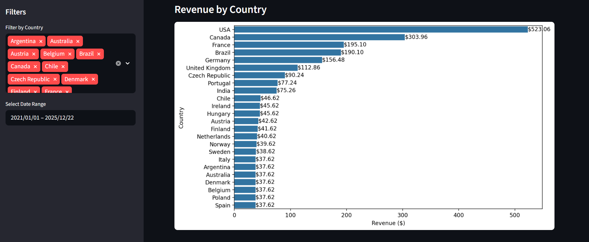

# 🎵 Chinook Music Store Analytics Dashboard
## 📸 Dashboard Preview






## 📊 Overview

An interactive Business Intelligence dashboard built using **SQL, Python, and Streamlit** to analyze sales performance, customer behavior, and revenue trends from the Chinook music store dataset.

This project demonstrates end-to-end data analytics skills including data extraction, transformation, and visualization.

---

## 📌 Key Insights

- Top-performing artists contribute significantly to overall revenue
- Revenue trends show monthly fluctuations indicating seasonal patterns
- Certain countries dominate revenue contribution, highlighting key markets

---

## 🚀 Features

* 🔍 Dynamic filtering (Country & Date range)
* 📈 Key business metrics (Revenue, Invoices, Customers)
* 🎤 Top 10 Artists by Revenue
* 📅 Monthly Revenue Trends
* 🌍 Revenue by Country
* ⚡ Optimized performance using caching

---

## 🧠 Key Skills Demonstrated

* SQL data extraction using PostgreSQL
* Data transformation using Pandas
* Data visualization using Seaborn & Matplotlib
* Building interactive dashboards using Streamlit
* Applying business logic for accurate aggregation
* Clean project structure and modular coding

---

## 🛠 Tech Stack

* Python
* PostgreSQL (Supabase)
* Pandas
* Streamlit
* Seaborn & Matplotlib
* SQLAlchemy

---

## 🔐 Data Handling

* Secure database connection using environment variables (`.env`)
* No credentials stored in code

---

## ▶️ How to Run Locally

1. Clone the repository
2. Create a virtual environment:

   ```
   python -m venv .venv
   ```
3. Activate the environment:

   ```
   .venv\Scripts\activate
   ```
4. Install dependencies:

   ```
   pip install -r requirements.txt
   ```
5. Create a `.env` file and add your database credentials
6. Run the app:

   ```
   streamlit run app/app.py
   ```

---

## 📌 Future Improvements

* Add more advanced KPIs (e.g., customer lifetime value)
* Improve UI styling
* Add export/download options

---

## 👨‍💻 Author

Kiran Paudel
